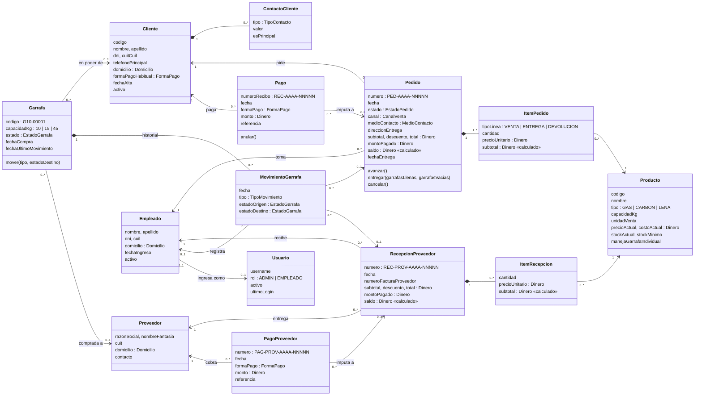
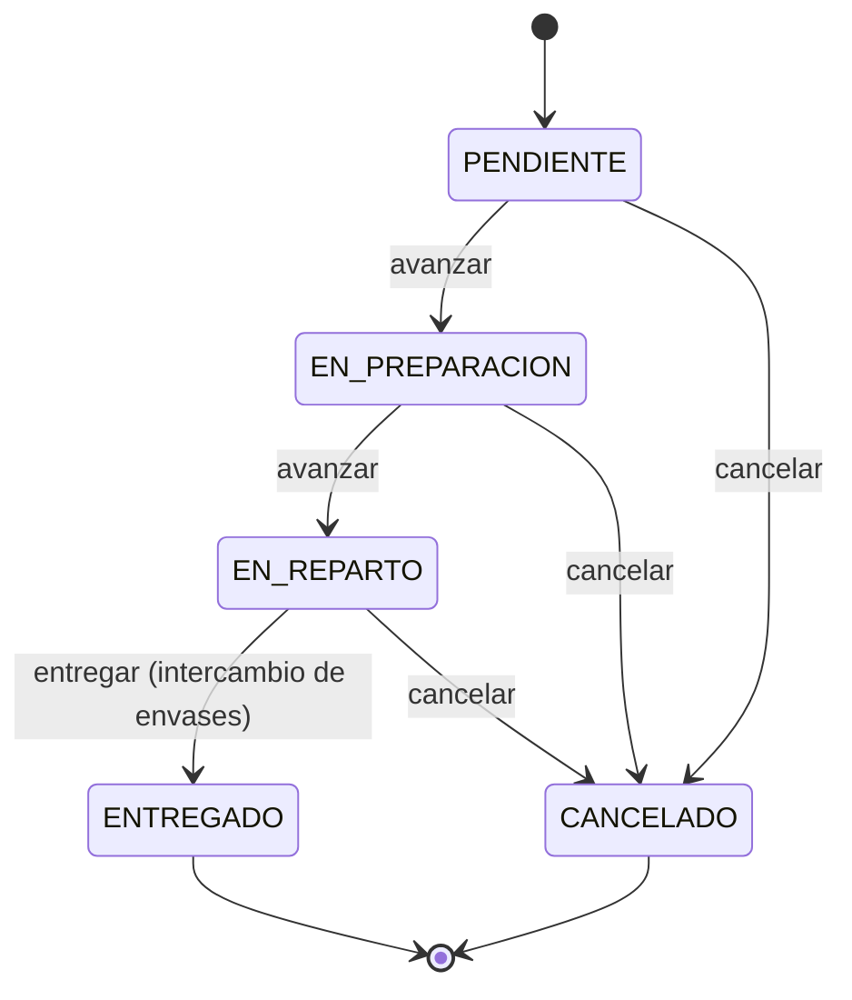
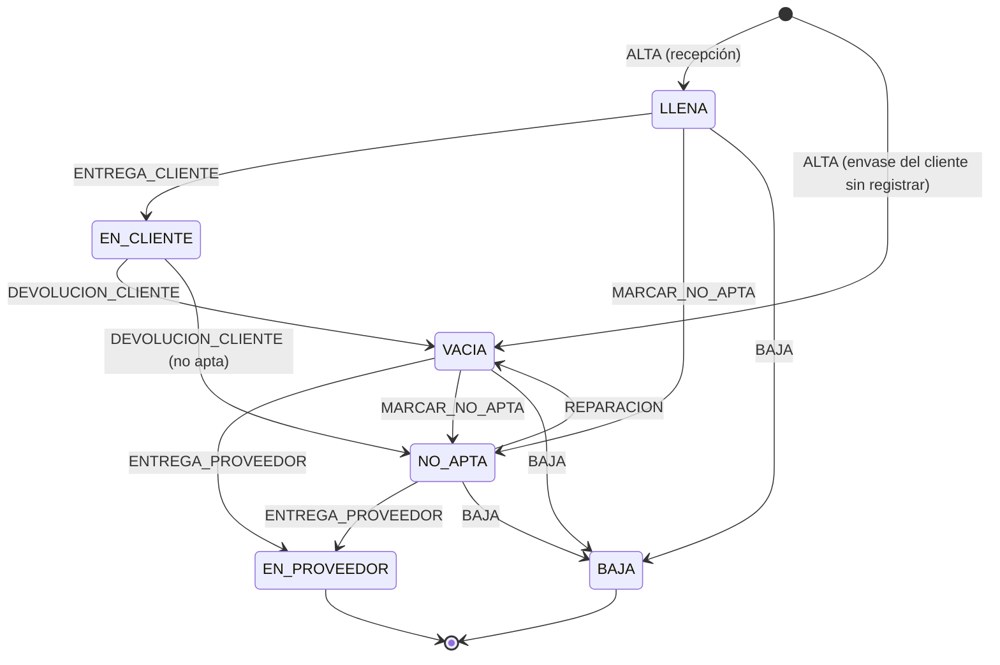

# Modelo de dominio · ExtraGas

Modelo conceptual del negocio que representa la base de datos `extragas`. Describe **qué cosas existen, cómo se relacionan
y qué reglas deben cumplirse**, sin detalles técnicos (claves, índices, columnas de auditoría).

## Contextos

| Contexto | Entidades | Responsabilidad |
|---|---|---|
| **Ventas** | Cliente, ContactoCliente, Pedido, ItemPedido, Pago | Tomar pedidos, entregarlos y cobrarlos |
| **Envases** | Garrafa, MovimientoGarrafa | Seguir cada garrafa individual y su historial |
| **Compras** | Proveedor, RecepcionProveedor, ItemRecepcion, PagoProveedor | Recibir mercadería, intercambiar envases y pagar |
| **Catálogo** | Producto | Qué se vende, a qué precio y con qué stock |
| **Personal y acceso** | Empleado, Usuario | Quién registra cada operación y con qué permisos |
| **Configuración** | ConfiguracionEmpresa, Secuencia | Datos de la empresa y numeración de comprobantes |

## Diagrama

`*--` es composición (el detalle no existe sin su dueño), `-->` es asociación.

## Objetos de valor y catálogos

| Tipo | Valores | Tabla |
|---|---|---|
| Dinero | `DECIMAL(12,2)` en pesos | — |
| Domicilio | calle, número, piso, depto, ciudad, código postal, provincia (24 provincias) | columnas en clientes / proveedores / empleados, `provincias` |
| EstadoPedido | PENDIENTE, EN_PREPARACION, EN_REPARTO, ENTREGADO, CANCELADO | `estados_pedido` |
| EstadoGarrafa | LLENA, VACIA, EN_CLIENTE, NO_APTA, EN_PROVEEDOR, BAJA | `estados_garrafa` |
| TipoMovimiento | ALTA, ENTREGA_CLIENTE, DEVOLUCION_CLIENTE, ENTREGA_PROVEEDOR, MARCAR_NO_APTA, REPARACION, BAJA, AJUSTE | `tipos_movimiento_garrafa` |
| FormaPago | EFECTIVO, TRANSFERENCIA, MERCADO_PAGO, DEBITO | `formas_pago` |
| CanalVenta | DOMICILIO, RETIRO_LOCAL, MOSTRADOR | `canales_venta` |
| MedioContacto | TELEFONO, WHATSAPP, PRESENCIAL, OTRO | `medios_contacto_pedido` |
| TipoContacto | CELULAR, TELEFONO_FIJO, WHATSAPP, EMAIL | `tipos_contacto_cliente` |
| TipoProducto | GAS, CARBON, LENA | `tipos_producto` |
| Rol | ADMIN, EMPLEADO | `roles` |

## Ciclos de vida

### Pedido

### Garrafa

## Reglas del dominio

Las marcadas con **(BD)** las garantiza la base de datos con triggers o columnas calculadas; el resto las aplica la aplicación.

**Ventas**
1. Cada pedido, recibo, recepción y pago a proveedor recibe un número correlativo por año: `PED-2026-00001`, `REC-2026-00001`, `REC-PROV-2026-00001`, `PAG-PROV-2026-00001`. **(BD)**
2. `subtotal` de cada ítem = cantidad × precio unitario, y `saldo` del pedido = total − monto pagado. **(BD)**
3. El monto pagado de un pedido es la suma de sus pagos no anulados, y se recalcula al registrar, modificar o anular un pago. **(BD)**
4. Un pedido tiene al menos un ítem de tipo `VENTA`. Las líneas `ENTREGA` y `DEVOLUCION` se agregan al entregar, con precio 0, y registran los envases que salieron y volvieron.
5. Un pedido avanza siempre en el mismo orden: Pendiente → En preparación → En reparto → Entregado. Llega a Entregado sólo confirmando la entrega.
6. Sólo se cancela un pedido que no está finalizado y no tiene pagos. Los pedidos cancelados no cuentan como deuda ni como venta.
7. La dirección de entrega sólo se guarda cuando el canal es `DOMICILIO`.
8. Un pago puede quedar a cuenta del cliente, sin imputarse a un pedido.

**Envases**

9. El estado de una garrafa sólo cambia registrando un movimiento, y el movimiento actualiza el estado y la fecha del último movimiento. **(BD)**
10. Una garrafa en estado `EN_CLIENTE` tiene que tener un cliente asignado. **(BD)**
11. Al entregar un pedido, cada garrafa llena que sale pasa a `EN_CLIENTE`. Cada vacía que devuelve el cliente tiene que estar a su nombre, y vuelve como `VACIA` o `NO_APTA`.
12. Un envase que el cliente trae sin estar registrado se da de alta como `VACIA`.
13. Las garrafas `EN_PROVEEDOR` o `BAJA` salen del parque activo.
14. La capacidad de la garrafa (10, 15 o 45 kg) la vincula con el producto de gas de la misma capacidad.

**Compras**

15. En una recepción, las garrafas llenas que llegan se dan de alta como `LLENA` y las vacías que se lleva el proveedor pasan a `EN_PROVEEDOR`.
16. El monto pagado de una recepción es la suma de sus pagos a proveedor no anulados. **(BD)**

**Catálogo**

17. El gas se controla por garrafa individual (`manejaGarrafaIndividual`), mientras que el carbón y la leña se controlan por cantidad (`stockActual`, con alerta bajo `stockMinimo`).

**Transversales**

18. Clientes, proveedores, productos, pedidos, pagos, garrafas, empleados y usuarios no se borran: se marcan con `deleted_at` (anulación o baja lógica).
19. Cada alta y modificación registra qué usuario la hizo (`created_by`, `updated_by`).
20. Sólo el rol ADMIN anula pagos, cambia precios en forma masiva y administra usuarios, empleados y la configuración.

## De las tablas al modelo

| Tabla | Entidad del dominio |
|---|---|
| `clientes`, `cliente_contactos` | Cliente, ContactoCliente |
| `pedidos`, `pedido_items` | Pedido, ItemPedido |
| `pagos` | Pago |
| `garrafas`, `movimientos_garrafa` | Garrafa, MovimientoGarrafa |
| `productos` | Producto |
| `proveedores` | Proveedor |
| `recepciones_proveedor`, `recepcion_items` | RecepcionProveedor, ItemRecepcion |
| `pagos_proveedor` | PagoProveedor |
| `empleados`, `usuarios` | Empleado, Usuario |
| `configuracion_empresa` | ConfiguracionEmpresa |
| `secuencias` | Secuencia (numeración) |
| `provincias` y los 9 catálogos | Objetos de valor / enumeraciones |
| Vistas `v_*` | Consultas de lectura (saldos, regularidad, stock, rankings), no son entidades |
